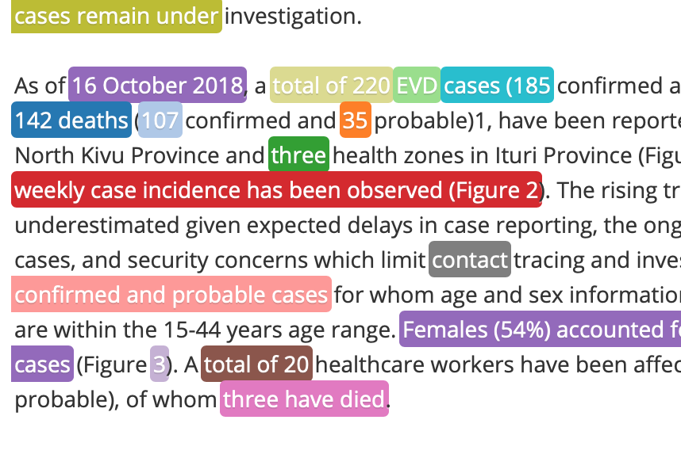
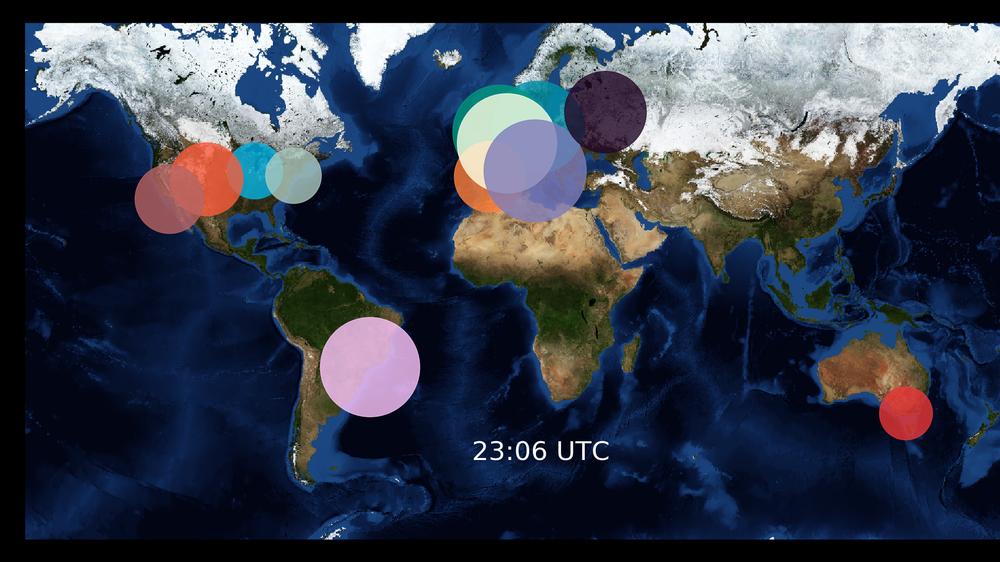
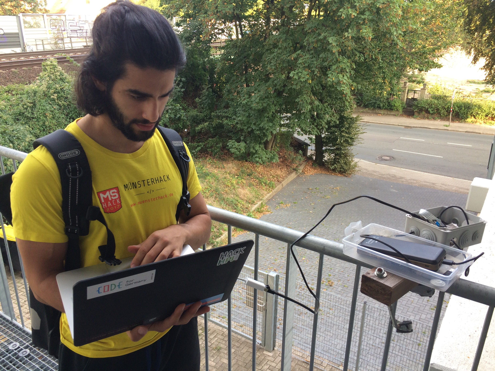
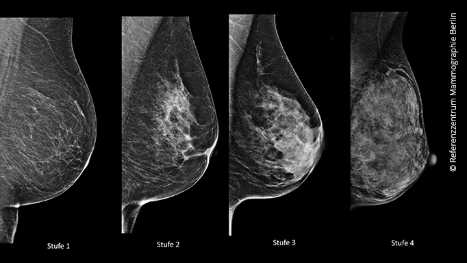

<!-- Main -->

<!-- One -->
<section id="one">
	

		<header class="major">
			<h2>Intro</h2>
		</header>
		
Dont know what to write.

	

</section>

<!-- Two -->
<section id="two" class="spotlights">
	<section>
		
		

			

				<header class="major">
					<h3>Natural Language Processing For Epidemiological Surveillance</h3>
				</header>
				
The epidemiological surveillance of the Robert Koch Institute (the public health institute of Germany) is screening outbreak news from several sources on a daily
				basis. These outbreaks need to be analysed and reported to the Minestry Of Health. My project tries to summarize articles of interest and reduce writing work. Additionally,
				I utilize former decision of the epidemiologists to train a classifier that allows to filter interesting news from the web that are usaually beyond their scope.

				<ul class="actions">
					<li><a href="generic.html" class="button">Learn more</a></li>
				</ul>
			

		

	</section>
	<section>
		
		

			

				<header class="major">
					<h3>A Timelaps Of The Blizzard Server Activity</h3>
				</header>
				
Using an estimate of the people online via CensusPuls UI, I showed the relative server use given people online for the American, Australien, and European World of Wacraft Server. The background image is from a NASA satellite. 

				<ul class="actions">
					<li><a href="generic.html" class="button">Learn more</a></li>
				</ul>
			

		

	</section>
	<section>
		
		

			

				<header class="major">
					<h3>Raspberry Pi Driven Cargo Train Surveillance </h3>
				</header>
				
Nullam et orci eu lorem consequat tincidunt vivamus et sagittis magna sed nunc rhoncus condimentum sem. In efficitur ligula tate urna. Maecenas massa sed magna lacinia magna pellentesque lorem ipsum dolor. Nullam et orci eu lorem consequat tincidunt. Vivamus et sagittis tempus.

				<ul class="actions">
					<li><a href="generic.html" class="button">Learn more</a></li>
				</ul>
			

		

	</section>
	<section>
		
		

			

				<header class="major">
					<h3>Implementing CapsNet And Detect Cancer In Mammophray  </h3>
				</header>
				
Nullam et orci eu lorem consequat tincidunt vivamus et sagittis magna sed nunc rhoncus condimentum sem. In efficitur ligula tate urna. Maecenas massa sed magna lacinia magna pellentesque lorem ipsum dolor. Nullam et orci eu lorem consequat tincidunt. Vivamus et sagittis tempus.

				<ul class="actions">
					<li><a href="generic.html" class="button">Learn more</a></li>
				</ul>
			

		

	</section>
	<section>
		
		

			

				<header class="major">
					<h3> Co-found Of The Open Knowledge Lab Osnabrück </h3>
				</header>
				
Nullam et orci eu lorem consequat tincidunt vivamus et sagittis magna sed nunc rhoncus condimentum sem. In efficitur ligula tate urna. Maecenas massa sed magna lacinia magna pellentesque lorem ipsum dolor. Nullam et orci eu lorem consequat tincidunt. Vivamus et sagittis tempus.

				<ul class="actions">
					<li><a href="generic.html" class="button">Learn more</a></li>
				</ul>
			

		

	</section>
	<section>
		
		

			

				<header class="major">
					<h3> Tumblr-Likes Analysis </h3>
				</header>
				
Nullam et orci eu lorem consequat tincidunt vivamus et sagittis magna sed nunc rhoncus condimentum sem. In efficitur ligula tate urna. Maecenas massa sed magna lacinia magna pellentesque lorem ipsum dolor. Nullam et orci eu lorem consequat tincidunt. Vivamus et sagittis tempus.

				<ul class="actions">
					<li><a href="generic.html" class="button">Learn more</a></li>
				</ul>
			

		

	</section>
</section>

<!-- Three -->
<section id="three">
	

		<header class="major">
			<h2>Massa libero</h2>
		</header>
		
Nullam et orci eu lorem consequat tincidunt vivamus et sagittis libero. Mauris aliquet magna magna sed nunc rhoncus pharetra. Pellentesque condimentum sem. In efficitur ligula tate urna. Maecenas laoreet massa vel lacinia pellentesque lorem ipsum dolor. Nullam et orci eu lorem consequat tincidunt. Vivamus et sagittis libero. Mauris aliquet magna magna sed nunc rhoncus amet pharetra et feugiat tempus.

		<ul class="actions">
			<li><a href="generic.html" class="button next">Get Started</a></li>
		</ul>
	

</section>

